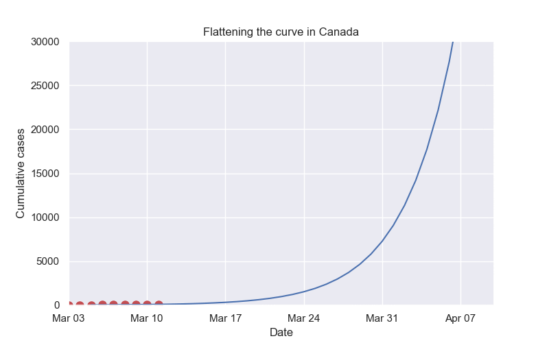

# Animation of Covid data for Canada

The python script in this project generates the GIF files below. 

The idea is to show how predictions of today's numbers (at the far right) have changed over time, converging on the actual value at the end of the animation.

Each line is a best fit to the previous several days of cumulative Covid-19 cases in Canada, currently using an exponential curve. In early March, the predictions suggested a big growth into the future, so that by now (mid April) some predictions would give us over a hundred thousand cases. Over time, those predictions have come down.

The fitting is naive. This is not sophisticated modeling and I am not an epidemiologist. The purpose is to illustrate what I hope is obvious, that the unprecedented physical distancing measures that we have all been taking over the past several weeks have had an effect. That things could have been so much worse.

The data comes from the COVID-19 Canada Open Data Working Group. Epidemiological Data from the COVID-19 Outbreak in Canada. https://github.com/ishaberry/Covid19Canada. 

## Details

To save a GIF file the script uses ImageMagick. Configuration for Windows is described in the top answer to [this Stack Overflow question](https://stackoverflow.com/questions/23417487/aving-a-matplotlib-animation-with-imagemagick-and-without-ffmpeg-or-mencoder/42565258#42565258). In summary:

- Install ImageMagick. I use the [chocolatey](https://chocolatey.org/) package manager for Windows and installed ImageMagick with that.
- Set an environment variable MAGICK_HOME pointing to the '<your-install-dir>\modules\coders' folder. You will need to start a new command prompt session after setting this for your environment to pick it up.
- Point MatPlotLib to the install directory. This is hard-coded for now. I may move it to a config file is there is any interest. It's the IMAGEMAGICK_DIR constant.

This post [How to create animated graphs in python](https://towardsdatascience.com/how-to-create-animated-graphs-in-python-bb619cc2dec1) by Viviane Kakerbeck was very helpful. 

## Usage

To display an animated graph of cumulative cases (the default):

> python animate_covid.py
or
> python animate_covid.py -p cases

To display an animated graph of growth rate:

> python animate_covid.py -p growth

To save the graph in a gif or mp4 file in the current directory instead of displaying it

> python animate_covid.py -p <plot_type> --save [gif] mp4

## Output

<video width="640" height="480" autoplay controls>
  <source src="covid.mp4" type="video/mp4">
  <source src="movie.ogg" type="video/ogg">
  Your browser does not support the video tag.
</video>

